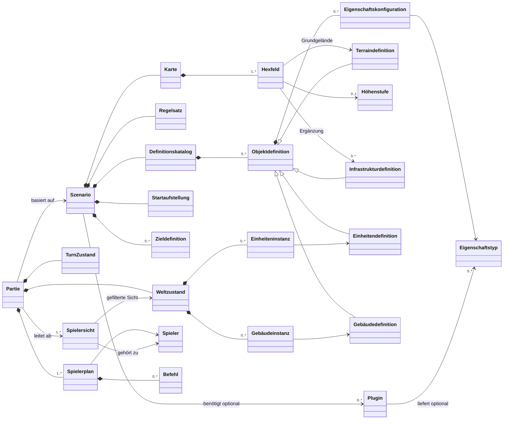
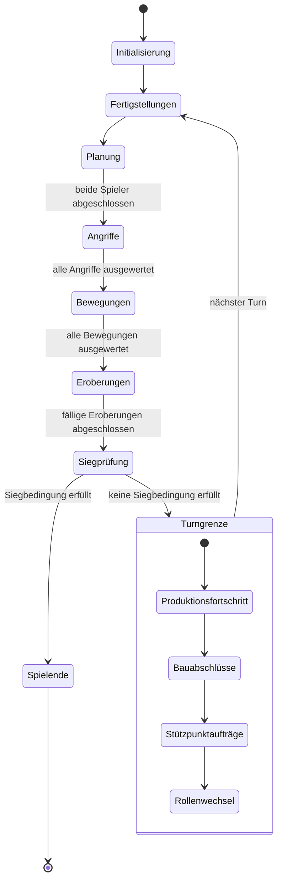

# Fachliches Datenmodell

Grundlagen: [Konzept](Konzept.md), [Design](Design.md), [Spielregeln](Spielregeln.md) und [Glossar](Glossar.md). Dieser Entwurf beschreibt die gemeinsamen Fachbegriffe für Client und Server. Er legt weder Attribute, Methoden, Speicherformate noch Netzwerknachrichten fest.

## Modellgrenzen

Der Server verwaltet die maßgebliche `Partie` und wertet sie mit dem gemeinsamen Fachkern aus. Clients arbeiten mit einer für ihren Spieler abgeleiteten `Spielersicht`; sie enthält keine verdeckten Gegnerpläne und keine Einheiten außerhalb der aktuellen Sicht.

Ein `Szenario` ist die unveränderliche Vorlage einer Partie. Es enthält Karte, Regeln, Definitionen, Ziele und Startaufstellung. Der `Weltzustand` einer `Partie` enthält dagegen die während des Spiels veränderlichen Instanzen und ihren Aufenthaltsort. Damit bleiben Szenario und Spielstand fachlich getrennt.

`Eigenschaftstyp` steht für wiederverwendbare fachliche Fähigkeiten, beispielsweise Bewegung, Sicht, Angriff, Aufnahme, Eroberung, Bau, Produktion oder Geländedeckung. Eine Definition erhält ihre Fähigkeiten ausschließlich über Konfigurationen solcher Typen, nicht über ihren Anzeigenamen. Plugins können zusätzliche Typen liefern, ändern aber nicht die Kernbeziehungen des Modells.

`Befehl` bleibt absichtlich abstrakt: Bewegungen, Angriffe, Ladeaktionen, Bau- und Produktionsaufträge werden erst beim Entwurf der Befehls- und Validierungsschnittstelle konkretisiert. Ein `Spielerplan` ist von der laufenden Welt getrennt, damit eigene Planänderungen vor dem Abschluss keine vorzeitige Zustandsänderung und keine Informationsweitergabe verursachen.

## Zustandsmaschine der Partie

`TurnZustand` ist keine bloße Zählvariable. Die serverautoritativ ausgeführte Zustandsmaschine bestimmt, wann Pläne angenommen werden und welche fachlichen Änderungen verbindlich in den Weltzustand übergehen.

Die Zustände spiegeln die bestätigte Reihenfolge wider: Angriffe einschließlich möglicher Gegenwehr vor Bewegungen, dann fällige Eroberungen und Siegprüfung. Produktionsfortschritt, Bauabschlüsse und Stützpunktaufträge folgen nur bei fortgesetzter Partie. Details innerhalb eines Zustands, etwa die Eingabereihenfolge einzelner Angriffe oder offene Regeln zu Bauplätzen, bleiben Regeln des jeweiligen Fachbereichs und werden nicht als zusätzliche Modellklassen vorweggenommen.

## Bewusste Auslassungen

- IDs, Attribute und konkrete Kotlin-Typen folgen erst mit dem API- und Speicherformatentwurf.
- Sichtgeometrie, Kampfformel, konkrete Produktions- und Bauparameter sowie die Behandlung fehlgeschlagener Folgeaufträge bleiben gemäß [Entscheidungen](Entscheidungen.md) offen.
- Transportprotokoll, Wiederverbindung und persistente Spielstände werden in eigenen Schnittstellen- und Formatentwürfen ergänzt.
