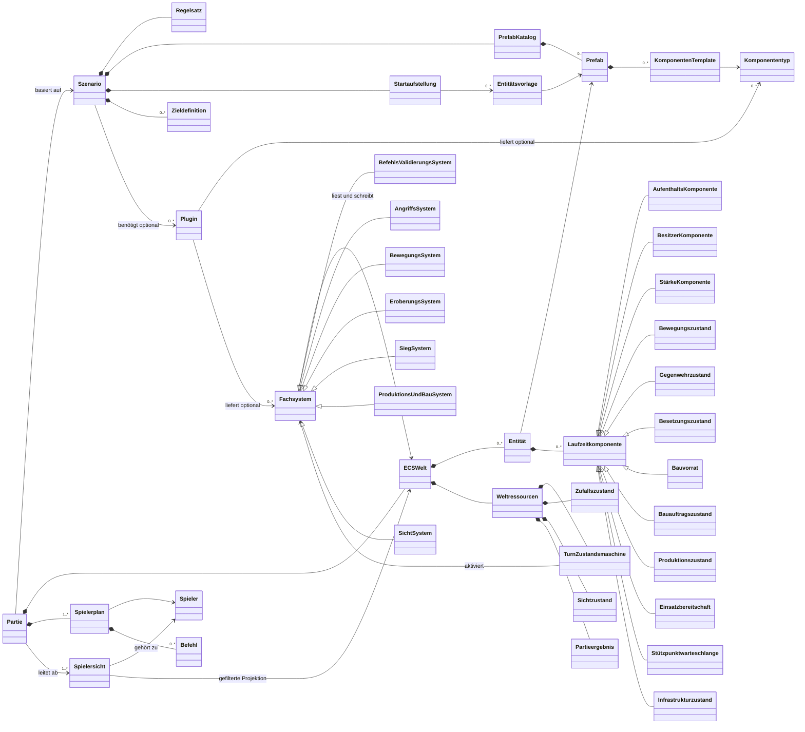
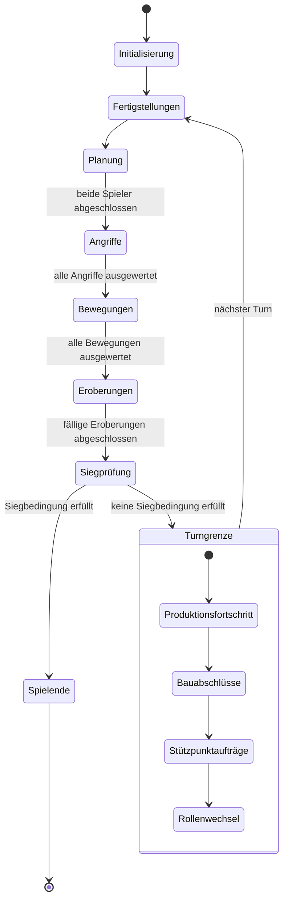

# Fachliches ECS-Datenmodell

Grundlagen: [Konzept](Konzept.md), [Design](Design.md), [Spielregeln](Spielregeln.md) und [Glossar](Glossar.md). Dieser Entwurf beschreibt die gemeinsamen Fachbegriffe für Client und Server als Entity-Component-System (ECS). Er legt weder Attribute, Methoden, Speicherformate noch Netzwerknachrichten fest.

## Modellgrenzen

Ein `Prefab` ist die unveränderliche Objektdefinition. Es enthält Komponenten-Templates mit den Parametern eines Einheitentyps, eines Gebäudes oder eines Terrainfelds.

Eine `Entität` ist dagegen ein konkretes Spielobjekt einer Partie. Sie verweist auf ihr Prefab und trägt ausschließlich veränderliche Laufzeitkomponenten.

Der Server verwaltet die maßgebliche ECS-Welt und wertet sie mit dem gemeinsamen Fachkern aus. Clients erhalten nur eine für ihren Spieler abgeleitete `Spielersicht`; sie enthält keine verdeckten Gegnerpläne und keine Einheiten außerhalb der aktuellen Sicht.

Ein `Szenario` enthält Regeln, Prefabs, Ziele und eine Startaufstellung. Die Startaufstellung beschreibt die Entitäten, aus denen die ECS-Welt einer Partie initial erzeugt wird. Damit bleiben Szenario und Spielstand fachlich getrennt.

Die genannten Komponenten beschreiben keine Klassenhierarchie. Eine Entität ist eine Einheit, ein Gebäude oder ein Hexfeld ausschließlich durch ihre Komponentenmenge. Grundterrain und Höhe sind unveränderliche Komponenten-Templates des Prefabs eines Hexfelds. Dynamisch errichtete Infrastruktur liegt dagegen als Laufzeitkomponente am Hexfeld. Gebäude und Einheiten sind eigene Entitäten an diesem Feld.

Bestehende fachliche Eigenschaften werden als Komponententypen ausgedrückt. Bewegung, Sicht, Angriff, Aufnahme, Eroberung, Bau, Produktion und Geländedeckung bleiben damit kombinierbar und hängen nicht am Anzeigenamen eines Spielobjekts. Ein Template enthält die unveränderliche Konfiguration; eine Laufzeitkomponente enthält nur den während der Partie veränderlichen Anteil.

## Laufzeitkomponenten

| Laufzeitkomponente | Verantwortlicher Zustand | Quelle der Wahrheit und Lebenszyklus |
|---|---|---|
| Aufenthaltskomponente | Aktueller Ort auf einem Hexfeld oder in einem Aufnahmeobjekt | Einzige Quelle für Aufenthaltsort, Inventar und belegte Kapazität; Entfernen der Entität entfernt die Zugehörigkeit. |
| Besitzerkomponente | Aktueller Besitzer einer Einheit oder eines Gebäudes | Ändert sich nur durch fachliche Systeme, etwa bei erfolgreicher Eroberung. |
| Stärkekomponente | Aktuelle Verbandsstärke | Kampfsystem verringert sie sofort; bei Zerstörung wird die Entität entfernt. |
| Bewegungszustand | Verbleibendes Bewegungsbudget und Sperre nach Laden | Zu Beginn der Bewegungsphase des Besitzers zurückgesetzt; das Laden sperrt die weitere eigene Bewegung bis zum Turnende. |
| Gegenwehrzustand | Bereits verbrauchte Gegenwehr im Turn | Zu Beginn jedes Turns zurückgesetzt; nach der ersten zulässigen Reaktion als verbraucht markiert. |
| Besetzungszustand | Erobernde Einheit und ihr Zielgebäude | Entsteht beim regelgerechten Besetzen, endet durch Zerstörung, Abbruch oder erfolgreichen Besitzerwechsel. |
| Bauvorrat | Aktuelle Baupunkte einer Baueinheit | Unabhängig von Verbandsstärke und Produktionsfortschritt; Auffüllung erfolgt durch das Stützpunktsystem. |
| Bauauftragszustand | Laufender Bauauftrag einer Baueinheit | Baupunkte werden beim Start abgezogen; der Zustand entfällt bei Abbruch, Bewegung oder Zerstörung. |
| Produktionszustand | Aktiver Auftrag, Fortschritt und Warteschlange einer Fabrik | Fortschritt wird nur im bestätigten Turngrenzschritt geschrieben; Abbruch und Eroberung setzen ihn gemäß Regeln zurück. |
| Einsatzbereitschaft | Sperre neu produzierter Einheiten bis zur nächsten eigenen Bewegungsphase | Entsteht bei Fertigstellung; wird erst zu Beginn der folgenden eigenen Bewegungsphase entfernt. |
| Stützpunktwarteschlange | Gemeinsame Reparatur- und Baupunkteauffüllaufträge eines Stützpunkts | Das Stützpunktsystem bearbeitet nach den Bewegungen des Besitzers höchstens einen Auftrag pro Runde. |
| Infrastrukturzustand | Dynamisch errichtete Infrastruktur eines Hexfelds | Ergänzt das statische Terrain-Prefab; Bau- und Geländesysteme ändern ihn. |

Inventarlisten, belegte Kapazität und reguläre Feldbelegung sind bewusst keine Laufzeitkomponenten. Sie werden aus Aufenthaltskomponenten und den Aufnahmeparametern des jeweiligen Prefabs abgeleitet; damit existiert für eine Einheit nie eine zweite, widersprüchliche Zuordnung.

## Weltressourcen

Weltressourcen gehören zur ECS-Welt, nicht zu einer einzelnen Entität. Die `TurnZustandsmaschine` enthält die aktuelle Phase und Rollenverteilung. Der `Zufallszustand` sichert reproduzierbare Auswertungen. Der `Sichtzustand` speichert die pro Spieler für den Turn feste Sichtfläche und wird erst vor der nächsten Planung neu berechnet. `Partieergebnis` hält fest, ob und wie die Partie beendet wurde.

Plugins dürfen zusätzliche Komponenten und Fachsysteme liefern. Sie dürfen jedoch keine zweite Quelle für Aufenthaltsort, Inventar, Feldbelegung oder Weltressourcen einführen; die Systeme leiten diese Werte stets aus den kanonischen Komponenten ab.

`Befehl` bleibt absichtlich abstrakt: Bewegungen, Angriffe, Ladeaktionen, Bau- und Produktionsaufträge werden erst beim Entwurf der Befehls- und Validierungsschnittstelle konkretisiert. Ein `Spielerplan` ist von der ECS-Welt getrennt, damit eigene Planänderungen vor dem Abschluss keine vorzeitige Zustandsänderung und keine Informationsweitergabe verursachen.

## Serverautoritativer Datenfluss

Nur Fachsysteme der maßgeblichen Serverauswertung verändern die ECS-Welt. Die Sichtprojektion filtert diese Welt für einen Spieler; sie ist kein zweiter verbindlicher Spielzustand. Clients dürfen daraus Darstellungs- und Interaktionszustand ableiten, aber keine Regeln verbindlich auswerten.

## Zustandsmaschine der Partie

`TurnZustandsmaschine` ist keine bloße Zählvariable. Sie aktiviert die passenden Fachsysteme in der bestätigten Reihenfolge und bestimmt damit, wann Befehle angenommen sowie welche Laufzeitkomponenten verändert werden.

Die Zustände spiegeln die bestätigte Reihenfolge wider: Angriffe einschließlich möglicher Gegenwehr vor Bewegungen, dann fällige Eroberungen und Siegprüfung. Produktionsfortschritt, Bauabschlüsse und Stützpunktaufträge folgen nur bei fortgesetzter Partie. ECS ersetzt diese Zustandsmaschine nicht, sondern stellt den Weltzustand und die von ihr ausgelösten Regelsysteme bereit.

## Bewusste Auslassungen

- IDs, Attribute und konkrete Kotlin-Typen folgen erst mit dem API- und Speicherformatentwurf.
- Sichtgeometrie, Kampfformel, konkrete Produktions- und Bauparameter sowie die Behandlung fehlgeschlagener Folgeaufträge bleiben gemäß [Entscheidungen](Entscheidungen.md) offen.
- Transportprotokoll, Wiederverbindung und persistente Spielstände werden in eigenen Schnittstellen- und Formatentwürfen ergänzt.
