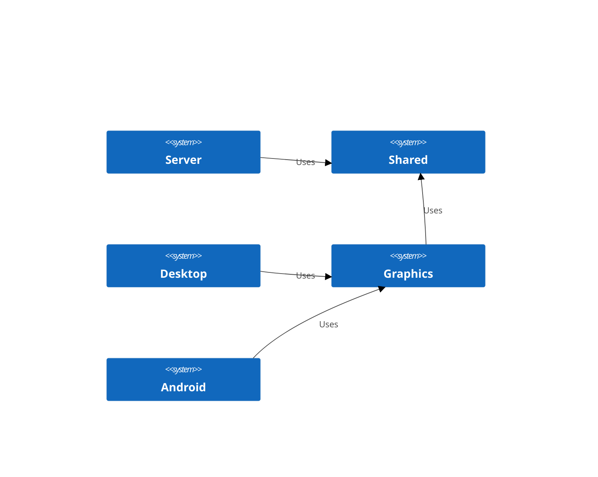
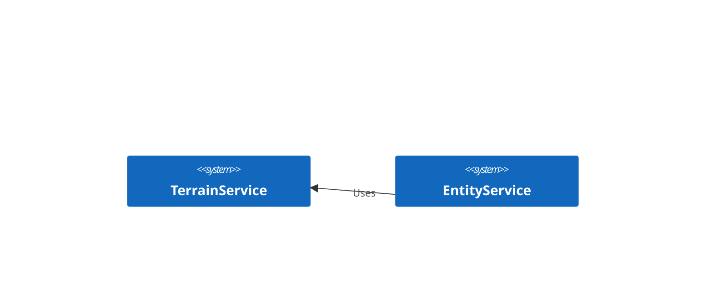
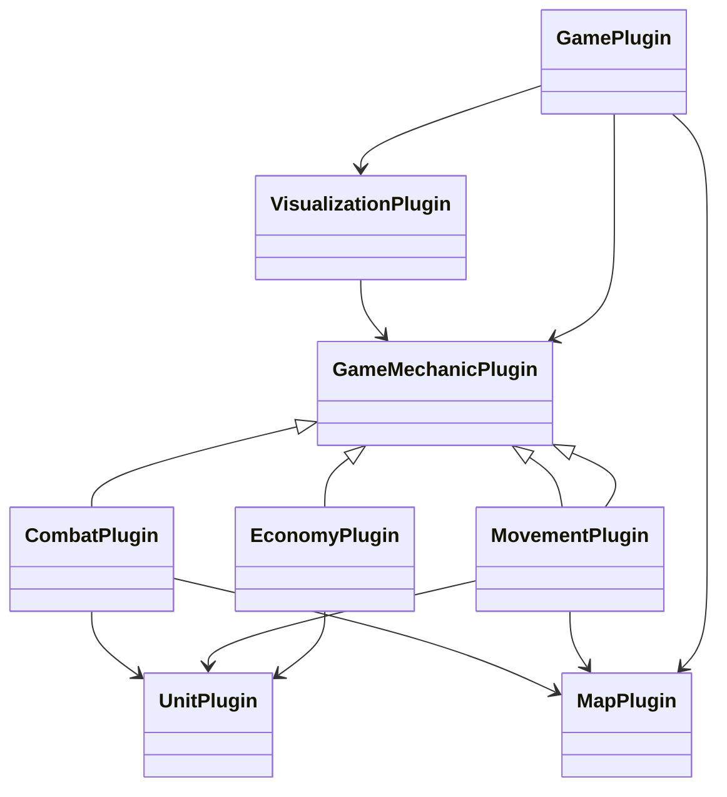
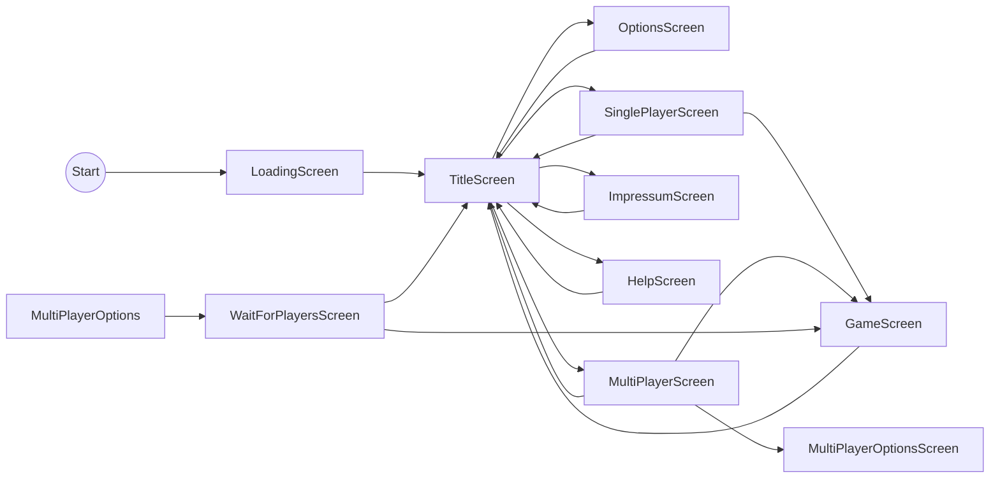
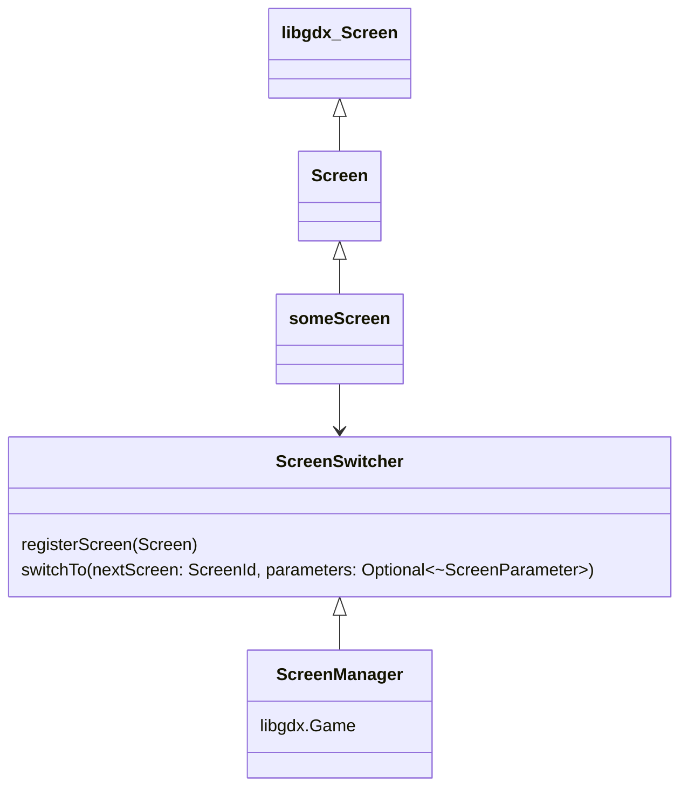
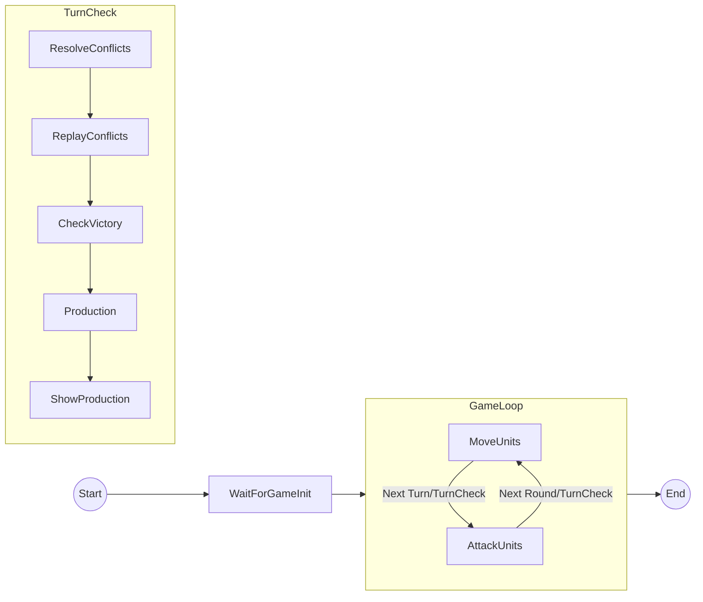

# Design

## Module

### Modul: Shared

Beinhaltend alle Datenstrukturen, Algorithmen und die Spielelogik

# Modul: Server

Beinhaltet alle "Shared"-Schnittstellen für einen Client-Server Betrieb. Enthält keine Spielelogik!

### Modul: Graphics

Alles, was zur grafischen Darstellung mit LibGDX notwendig ist.

### Diagramm

## Services

## Komponenten

## UI Ablauf

- Jeder Screen hat den selben Aufbau
- Jeder Screen hat eine eindeutige ID
- Der TitleScreen erlaubt die Erweiterung um neue Screens, die über Plugins reinkommen.

Das Design der Screens ist:

### Game Ablauf

# Ui
