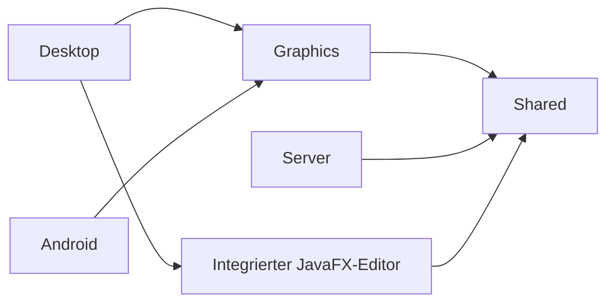
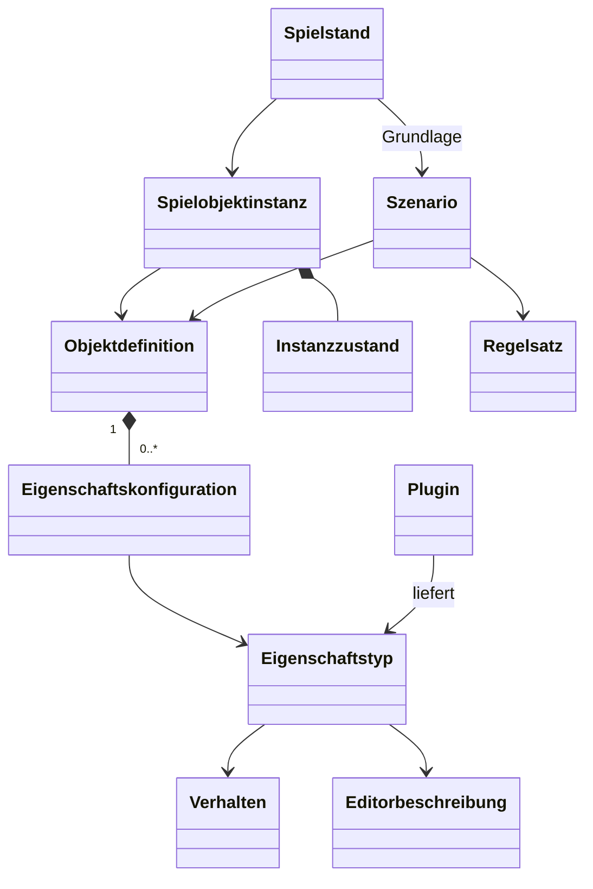
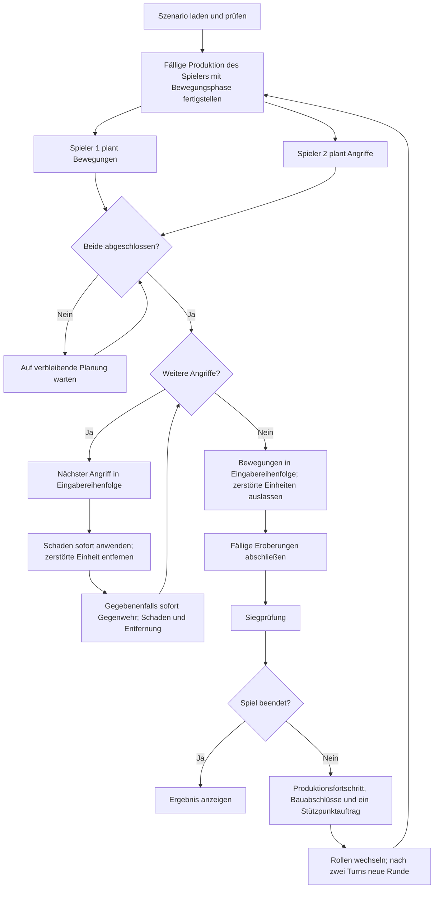
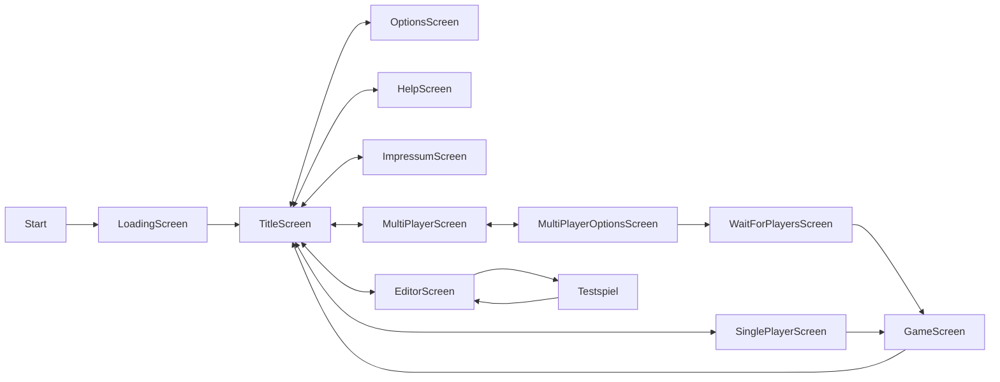
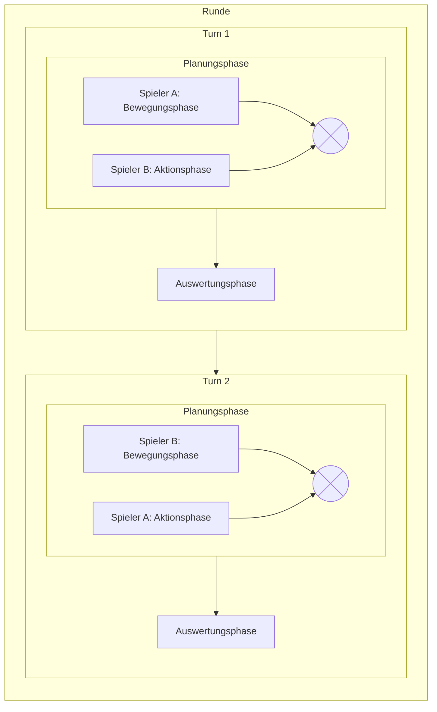

# Design

Grundlagen: [Konzept](Konzept.md), [Spielregeln](Spielregeln.md), [Glossar](Glossar.md). Dies ist ein Architekturentwurf; konkrete APIs, Dateischemata und Plugin-Ladeverfahren sind noch nicht festgelegt.

## Module und Abhängigkeiten

Die bisherigen Leitlinien Kotlin, LibGDX, Koin und Onion-Architektur bleiben erhalten. Spielregeln liegen im fachlichen Kern, unabhängig von Grafik, Netzwerk und Speicherung.

| Modul    | Verantwortung                                                                         |
|----------|---------------------------------------------------------------------------------------|
| Shared   | Definitionen, Instanzen, Befehle, Validierung und Auswertung                          |
| Server   | Zugriff auf Shared für Client-Server-Betrieb; keine zweite Implementierung der Regeln |
| Graphics | Darstellung und Interaktion mit LibGDX                                                |
| Desktop  | Desktopstart, zwei Spielerfenster und Integration des Editors                         |
| Android  | Androidstart und plattformspezifische Bedienung                                       |

Serverautoritativ bedeutet, dass die maßgebliche Instanz Befehle mittels Shared validiert und auswertet. Es widerspricht nicht der Vorgabe, dass das Server-Modul keine eigene Spielelogik enthält. Lokales Spiel, KI und Online-Spiel sollen denselben fachlichen Ablauf nutzen.

## Objektmodell durch Zusammensetzung

Eine Objektdefinition kombiniert Eigenschaften und Parameter. Eine Instanz verweist auf ihre Definition und trägt veränderlichen Zustand. Fähigkeiten werden aus Eigenschaften ermittelt, nicht aus Namen wie „Infanterie“ oder „Panzer“.

Beispiel: Standardinfanterie kombiniert Bewegung, Angriff, Sicht und Eroberung. Eine benutzerdefinierte Panzereinheit kann ebenfalls Eroberung erhalten. Ein Stützpunkt kombiniert unter anderem Aufnahme von Einheiten und Reparatur. Die genaue Aufteilung ist noch kein verbindliches API-Schema.

Definitionen enthalten beispielsweise Bewegungsbudget, Sichtweite, Transportkapazität, erlaubte Eroberungsziele oder produzierbare Typen. Instanzzustände enthalten beispielsweise Position, Besitzer, Schaden und Produktionsfortschritt. Geländeobjekte fallen ebenfalls unter das Prinzip der Zusammensetzung.

## Plugins und Editorintegration

Plugins besitzen eindeutige Identifikationen und deklarieren Abhängigkeiten. Sie können Eigenschaftstypen samt Verhalten, Inhalte, Regelmechaniken und Visualisierungen bereitstellen. Konfiguration kombiniert vorhandenes Verhalten; neue Verhaltensarten werden programmiert. Skripte sind nicht vorgesehen.

Fachlich erforderliche Verträge für die spätere Schnittstellendefinition:

- Eigenschaftstypen stellen bearbeitbare Parameter und deren Validierung bereit.
- Abhängigkeiten und unzulässige Eigenschaftskombinationen sind erkennbar.
- Der Editor kann neue Plugin-Eigenschaften aufnehmen, bearbeiten, speichern und laden.
- Laufzeit und Editor bewerten Konfigurationen nach denselben fachlichen Regeln.
- Fehlende Plugins oder ungültige Definitionen führen zu verständlichen Diagnosen statt stillschweigend verändertem Spielverhalten.

Ob generische Editorbeschreibungen, spezielle Bedienelemente oder beide erforderlich sind, wird mit dem Plugin-Vertrag entschieden. Versionierung, Migrationen und Konfliktauflösung bleiben offen (O-08, O-09 in [Entscheidungen](Entscheidungen.md)).

Die bisherigen Kategorien Combat-, Movement-, Economy-, Map-, Unit- und Visualization-Plugin sind mögliche Verantwortungsbereiche, keine festgeschriebene Vererbungshierarchie. TerrainService und EntityService bleiben Entwurfskandidaten; ihre Grenzen folgen dem Eigenschaftsmodell.

## Spielablauf und Spielersicht

Die Spielerbezeichnungen im Diagramm stehen für die jeweiligen Rollen und werden nach jedem Turn getauscht. Nur die Planung erfolgt parallel. Alle Angriffe einschließlich unmittelbar folgender Gegenwehr werden nacheinander ausgeführt; erst danach folgen alle Bewegungen. Schäden und Zerstörungen wirken sofort. Maßgeblich sind die [Wechselwirkungen](Spielregeln/Wechselwirkungen.md). Fällige Eroberungen schließen vor der Siegprüfung ab. Bei fortgesetzter Partie folgen Produktionsfortschritt,
Bauabschlüsse und die Stützpunktaufträge des Spielers mit Bewegungsphase. Vor Bau- oder Eroberungsabschluss muss eine vollständige gegnerische Angriffsgelegenheit liegen. Neu fertige Einheiten rücken erst in der darauffolgenden eigenen Bewegungsphase aus. Ergebnisdarstellungen dürfen keine unbeabsichtigten Informationen außerhalb der jeweiligen Spielersicht offenlegen.

Zwei Fenster repräsentieren zwei Spielersichten auf dieselbe Partie. Planungsänderungen sind bis zum eigenen Abschluss möglich; sie verändern noch nicht den maßgeblichen Weltzustand. Technische Trennung der Sichten verhindert kein Mitlesen am gemeinsamen Monitor.

## Bewegungsplanung und Transportzustand

Die [Bewegungs- und Transportregeln](Spielregeln/Bewegung_und_Transport.md) verlangen eine für den Turn feste Sichtfläche. Die vollständige Karte ist bekannt; Einheiten außerhalb dieser Fläche werden ohne Positionshistorie ausgeblendet. Jeder geplante Weg wird gegen diese Fläche geprüft. Erst vor der nächsten Planung wird Sicht aus den neuen Positionen berechnet; bei der Neuberechnung liefern Transportpassagiere keine eigene Sicht; der Beitrag von Gebäudeinsassen bleibt offen.

Die Planung berücksichtigt die erwarteten Positionen, Belegungen, freien Aufnahmeplätze und verbleibenden Budgets nach vorherigen eigenen Befehlen, ohne die verbindliche Welt vorzeitig zu ändern. Transporter verwenden ein gemeinsames Budget für Fahrt und Ladeaktionen. Aufnahmeprofil und Transportbedarf sind von Bewegungs- und Zielprofil getrennt. Ein- oder Ausladen sperrt weitere eigene Bewegung des Passagiers, nicht weitere Ladeaktionen des Transporters. Aufenthaltsort, belegte Plätze,
Restbudget und Bewegungssperre sind Laufzeitzustand. Konkrete APIs und die Behandlung fehlgeschlagener abhängiger Befehle bleiben offen.

## Oberflächen und Persistenz

Screens besitzen eindeutige IDs und einheitliche Navigation. Die bisherige Idee eines ScreenManagers mit Registrierung und Parameterübergabe bleibt für die LibGDX-Spielansicht erhalten. Der integrierte Desktop-Editor verwendet JavaFX für Oberfläche und Kartenansicht; der Desktopstarter vermittelt Navigation, Probespiel und Rückkehr zum Hauptmenü innerhalb derselben Anwendung. Plugins können zusätzliche Editoransichten bereitstellen. Eine direkte LibGDX-Einbettung ist nicht Teil der Architektur.

Speicherung bleibt hinter austauschbaren Schnittstellen; JSON ist die bisherige Minimaloption. Szenario und Spielstand sind verschiedene fachliche Datenobjekte. Ein Spielstand muss die zur Fortsetzung notwendige Szenariogrundlage, Plugin-Zuordnung, Zufallsinformationen und den aktuellen Zustand nachvollziehbar zuordnen können. Speicherformat und Kompatibilitätsregeln werden vor Umsetzung festgelegt.

## Bau- und Inventareigenschaften

Auftragsfortschritt der Fabrik, Baupunkte eines Pioniers und Verbandsstärke sind getrennte Zustände. Die Fabrik verarbeitet einen aktiven Auftrag und schreibt einmal je Runde nach einer erfolglosen Siegprüfung Fortschritt gut. Baupunkte werden beim Bauauftrag abgezogen. Inventarregeln für Angriffe, Angreifbarkeit, Gegenwehr und Sicht werden separat beschrieben: Gebäude erlauben Angriffe, verbieten aber gezielte Angriffe auf Insassen und deren Gegenwehr; Transportpassagiere bleiben ohne
Außenaktionen. [Bau und Produktion](Spielregeln/Bau_und_Produktion.md) und [Gebäude](Spielregeln/Gebaeude.md) sind die fachliche Grundlage.

# Einordnung Runde, Turn, Phase

