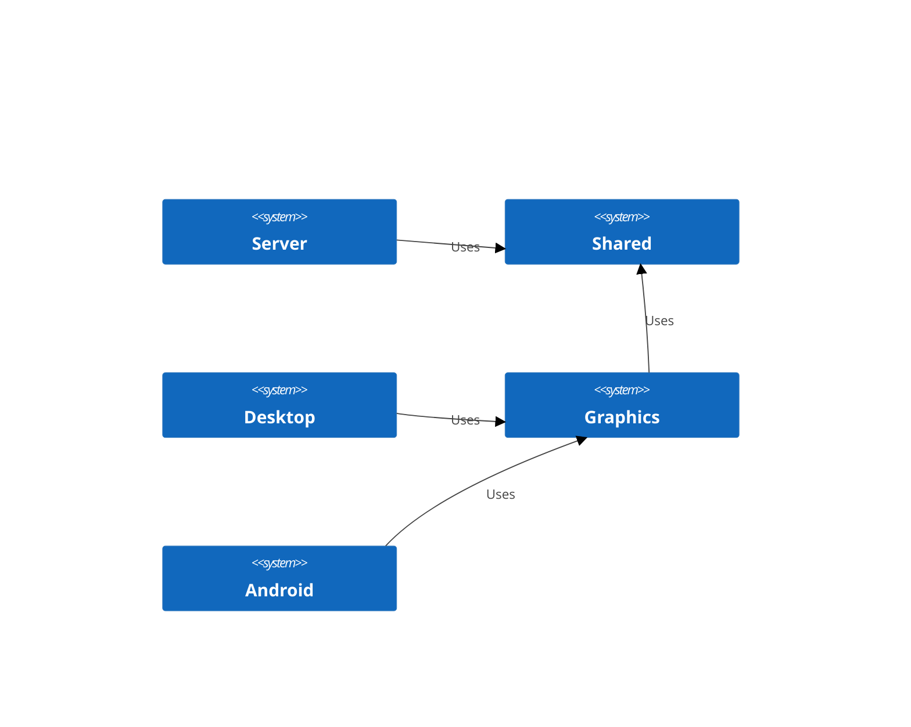
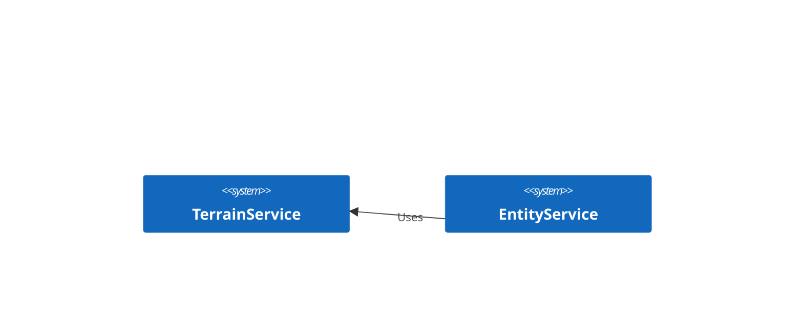

# Design

## Module

### Modul: Shared

Beinhaltend alle Datenstrukturen, Algorithmen und die Spielelogik

# Modul: Server

Beinhaltet alle "Shared"-Schnittstellen für einen Client-Server Betrieb. Enthält keine Spielelogik!

### Modul: Graphics

Alles, was zur grafischen Darstellung mit LibGDX notwendig ist.

### Diagramm

## Services

