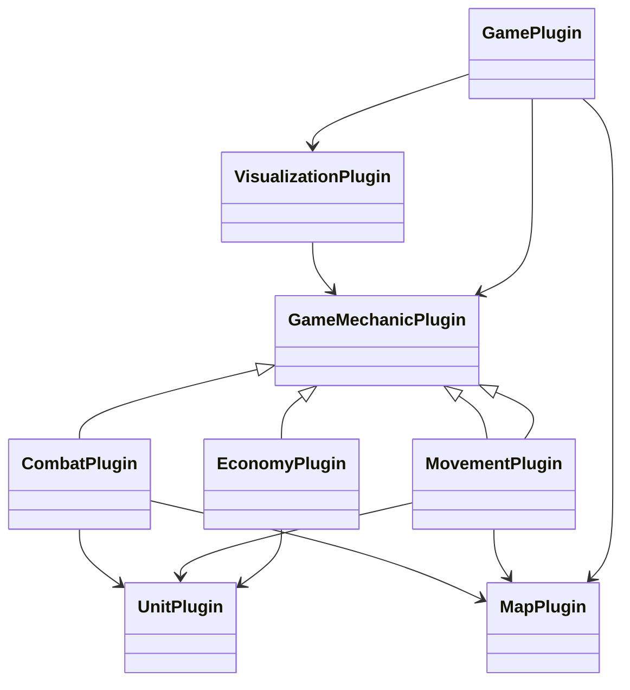
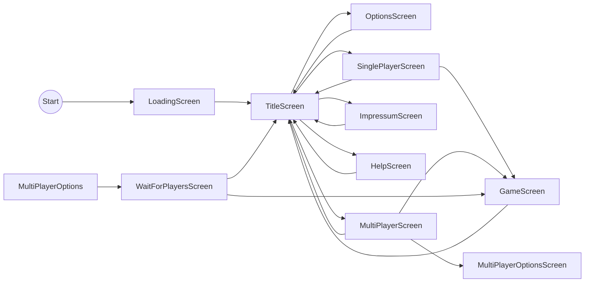
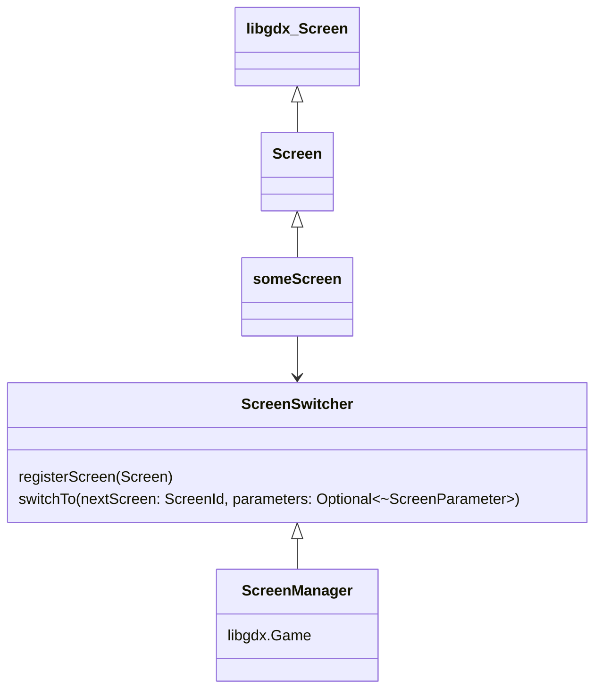
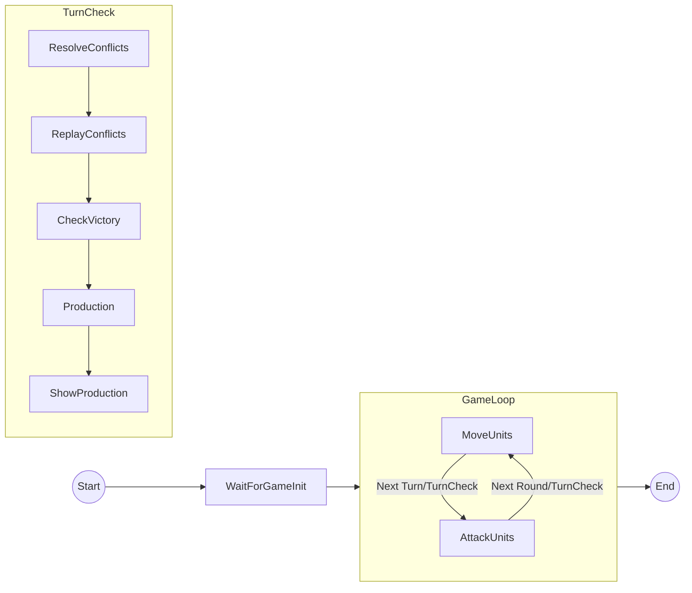

# Vision

Ein Einfach- oder Zweifachspieler-Strategiespiel im Stil von "Battle Isle".

# Zielgruppe

- Strategie-Nostalgiker
- Strategiespieler
- Kompetitive Spieler

## Plattformen

Windows Desktop und Mobile (Android)

# Technik

- LibGDX
- Kotlin
- Koin

## Spielstil

- Simultan wie bei "Battle Isle"
- Das Spiel deckt Militär, Wirtschaft, Forschung ab.
- Fokus liegt auf Militär.

# Anforderungen

Zwei Spiele-Modi:
- 1vs1
- Single Player mit Computergegner

## Spielfunktionen

### Szenario

Besteht aus:
- Karte (inkl. Einheiten)
- Einheitentypen
- Grafiken
- aktivierten Plugins
- Es gibt einen Editor für Szenarien (nur Desktop, JavaFX?)

### Karte & Welt

- Stil: Hexagon
- Größe: bis zu 100x100 Felder
- Inhalt:
    - Geländearten: Meer, Küste, Ebene, Wald, Berge, Städte, …
    - Sichtbarkeit: Fog of War je nach Reichweite pro Einheit/Städte/.... Aktive Bestimmung, man 
      sieht nur was man aktuell auch sehen kann. Bereits entdeckte Felder oder auch Einheiten werden "ausgegraut"
      dargestellt, man sieht immer die letzte Position, ausser die EInheit ist wieder woanders sichtbar.
- Generierung: Zufallskarte mit Seed oder vorgefertigtes Szenario
- Pro Hexagon nur eine Einheit, außer
  - In Städten/basen: mehrere Einheiten möglich
  - Transporteinheiten
  
### Einheiten & Städte

- Einheitentypen:
    - Land: Infanterie, Panzer, Artillerie …
    - See: Zerstörer, Schlachtschiff, Transporter …
    - Luft: Bomber, Jäger …
- Attribute:
    - Bewegungspunkte, Angriff, Verteidigung, Sichtweite, Transportkapazität, Anzahl, Erfahrung …
- Städte/Basen:
    - Produktion (Bau von Einheiten)
    - Ressourcen-Einnahmen
    - Eroberung & Verlust
    - Reparatur von Einheiten
- Alle Einheitentypen, Attribute, Grafiken etc bilden ein Einheiten-Plugin.

### Bewegung

- Realisiert als Plugin
- Abhängig vom Einheiten-Plugin
- Bewegungsregeln:
    - Bewegung durch verbündete Einheiten erlaubt
    - 
### Wirtschaft / Ressourcen

- Ressourcenarten:
    - Einfach: „Produktion“/„Industriepunkte“
- Verteilung:
    - Städte generieren X Punkte pro Runde.
- Ausgaben:
    - Bau von Einheiten
    - Unterhalt (optional)
- Realisiert als Plugin
- Abhängig vom Einheiten-Plugin

### Kampf

- Kampfsystem:
    - Würfel-basiert
    - Modifikatoren (Gelände, Moral, Erfahrung, angrenzende Einheiten)
- Realisiert als Plugin
- Abhängig vom Einheiten-Plugin
- Eroberung von Strukturen

### Regeln
- Auswertung von Zügen am Ende eines Turns
- Eine Round besteht aus zwei Turns: Movement, Attack
- Ein Spieler startet immer in Movement der andere in Attack, nach dem Ende eines Turns wechselt dies.
- Es gibt ein einfaches Undo: Der letzte Zug kann zurückgenommen werden.
  - Ein Zug wird nur aktiv, wenn der Turn beendet wird oder wenn eine andere Aktion ausgeführt wurde.

### Siegbedingungen

- Eroberung X % aller Städte, Vernichtung aller gegnerischer Einheiten, Eroberung von Zielen, ...
- Konfigurierbar beim Spielstart

### KI (SinglePlayer)
- KI-Schwierigkeitsgrade werden über Plugins umgesetzt
- Einfache KI: Erobere fremde Basen

## UI/UX

- Kartenansicht (Zoom, Scroll)
- Auswahl: Einheit/Tile/City
- Je nach aktuellen Modus, sieht man wohin eine Einheit bewegt werden oder wen sie angreifen kann
- Befehls-Eingabe:
    - Maus-basiert und Tastatur-Shortcuts
    - Infopanels (Einheitendetails, Stadtübersicht)
    - Log / Ereignismeldungen

## Interaktion

- Aktionen (wie Selektieren, Erobern einer Basis) können Events auslösen
- Plugins können Hooks auf diese Events haben und dann entsprechende Aktionen auslösen (hauptsächlich Grafik und Texte)

## Tutorial

- Spezielles Szenario, dass Texte als einblendet was als nächstes machbar ist.
- Es gibt explizite Hooks im System für alle Aktionen, ind er sich das Tutorial einhängt.

## Audio

- Es gibt eine sehr einfache Audio-Unterstützung (konfigurierbar):
  - Für Selection von Einheiten, Bewegung und Kampf
  - Je nach Einheit können unterschiedliche Töne abgespielt werden

## Nicht-funktionale Anforderungen

### Performance

- Max. Kartengröße: 100x100 Felder
- Ziel: KI-Zug < 5 Sekunden bei 100 Einheiten.

### Stabilität

- Robustes Speichersystem (Auto-Save).
- Abstürze sollen Spielstand nicht zerstören.

### Bedienbarkeit

- Maus & Tastatur voll nutzbar.
- Klare, lesbare Icons & Farben.
- Bei Auswahl sieht man immer, was man als Nächstes machen kann.
- Es gibt einen Hilfe-Bildschirm, der eine Anleitung zum Spiel besitzt.
- Das Spiel setzt i18n konsequent um.
- 
### Modularität / Erweiterbarkeit

- Alles über Plugins erweiterbar, die aber untereinander Abhängigkeiten haben können
- Es gibt einige Basisdefinitionen, Schnittstellen, die für alle Plugins gelten.
- Regeln, Einheiten, Werte möglichst in externen Dateien konfigurierbar

Ziel: später neue Einheiten/Techs hinzufügen, ohne Kernlogik neu zu schreiben.

### Multiplayer

- Sync-Modell: Online mit Server
- Lagerung von Spielständen serverseitig
- ELO Berechnung für 1vs1 
- Server steuert das gesamte Spiel:
  - Validierung von Aktionen
  - Timeouts für Spielzüge (konfigurierbar)

Es gibt mehrere Ausbaustufen:
- Alles in einer Applikation (nur Desktop -> Es werden zwei Fenster geöffnet)
- Lokales Spiel (Ein Spieler ist Server, andere Spieler können über Broadcast direkt das Spiel betreten)
- Einfaches Framework (Ein Spieler is Server), über Google
- Nakama: https://heroiclabs.com/nakama/

### Monetarization

- MultiPlayer nur gegen Geld möglich (Monatsgebühr), sonst nur X Spiele pro Monat möglich

### Persistenz & Spielstände

- Spiel wird nach jedem Turn automatisch gesichert und sind mit einem Szenario gleichzusetzen
- Komplette Historie bei Single-Player
- Single-Player: Alte Spielstände ladbar
- Die Abfolge von den selben Aktionen führt immer zum gleichen Ergebnis (Random Seed pro Szenario und pro Turn)

# Architektur

## ADR
- Onion-Architecture um möglichst wenig technische Abhängigkeiten zu haben
- Maximale Erweiterbarkeit, in der alle Komponenten ausgetauscht werden können
- Endausbaustufe Multi-Player: Nakama 
- Single/MultiPlayer werden intern gleich behandelt, für SinglePlayer wird MultiPlayer instantiiert, wobei 
  der Gegenspieler durch einen Computer simuliert wird
- Backend-Datenhaltung: Ist austauschbar und sichert in der Minimalstufe die Daten über JSON
- Plugins haben eine eindeutige Identifikation und geben von welchen Plugins sie abhängig sind.

## Komponenten

## UI Ablauf

- Jeder Screen hat den selben Aufbau
- Jeder Screen hat eine eindeutige ID
- Der TitleScreen erlaubt die Erweiterung um neue Screens, die über Plugins reinkommen.

Das Design der Screens ist:

### Game Ablauf

# Ui

# Planung

- Vor der Umsetzung eines Plugins wird dieses entsprechend detailliert.
- Vor dem Start der Iteration werden alle Stories genau definiert.

## Iteration: Karten- und Datenbasis

Ziel: Eine Karte anzeigen, Tiles intern repräsentieren.

Stories:

- [ ] Datenstrukturen für Karte erzeugen (Grid + Geländearten). Schnittstellen anlegen
- [ ] Zufallsgenerator für einfache Karten.
- [ ] Kartenanzeige (2D, einfache Tiles).
- [ ] Auswahl von Tiles mit Maus.
- [ ] Darstellung eines Infobereichs für das ausgewählte Tile

# Iteration: Minimale Gameloop

Das Spiel startet im Movement-Turn, wenn der Spieler einen Turn beendet, kommt sofort der nächste Movement-Turn.

# Iteration: Einheiten & Bewegung

Ziel: Einheiten platzieren und bewegen.

Stories:

- [ ] Datenmodell für Einheiten (Typ, Position, Bewegungspunkte).
- [ ] Einheiten auf Karte anzeigen.
- [ ] Einheit auswählen
- [ ] Zielkachel anklicken
- [ ] Bewegung ausführen (ohne Kampf)

# Iteration: Städte & Produktion

Ziel: Städte, Produktion, einfache Ressourcen.

Stories:

- Städte im Modell + Anzeige.
- Jede Stadt erzeugt X Produktion pro Runde.
- Produktionswarteschlange: Einheit auswählen, nach N Runden fertig.
- Einheiten erscheinen in der Stadt bei Fertigstellung (Movement-Turn).

# Iteration: Spielelogik
- Umsetzung der kompletten Game-Loop, aber kein Wechsel der Spieler

# Iteration: Kampf & Siegbedingungen

Ziel: Basis-Kampfsystem und Spielende, Zustand: ResolveConflicts

Stories:

- Kampfregeln: Wenn Einheit eine gegnerische Einheit angreift, wende Kampfalgorithmus an.
- Eroberung von Städten: Einheit betritt gegnerische Stadt → Besitzerwechsel.
- Siegbedingung: Wenn ein Spieler keine Städte mehr hat → Game Over.
- Bewegung/Aktion wird nicht ausgeführt wenn Einheit zerstört wurde

# Iteration: Zwei-Spieler

Ziel: Es können zwei Spieler teilnehmen und die Gameloop ist komplett implementiert.

# MVP
Es existiert eine erste spielbare Version. Es werden für beide Spieler zwei Fenster geöffnet und man kann an einem Computer/Desktop 
eine komplettes Spiel durchspielen.

# Iteration: UI (Spielstart etc)
- siehe UI Ablauf

# Save/Load

# Iteration: Plugins umsetzen

# Iteration: Server/Client

# MVP
Es ist möglich ein Multi-Player spiel zu starten und zu spielen. Dazu werden zwei Instanzen gestartet und über eine einfache Netzwerkkommunikation
werden die Spieldaten ausgetauscht.

# Audio

# Iteration: KI (einfach)

# Iteration: Android-Version UI verbessern

# Iteration: UI-Verbesserungen, Optimierungen

# Iteration: Mehr Einheitentypen, mehr Gelände, Balancing
